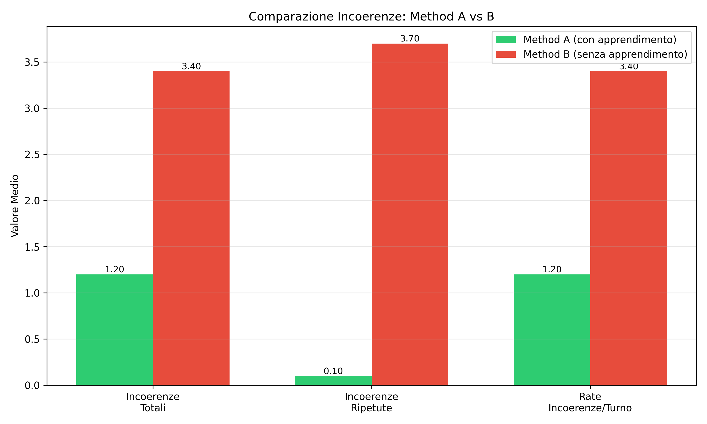
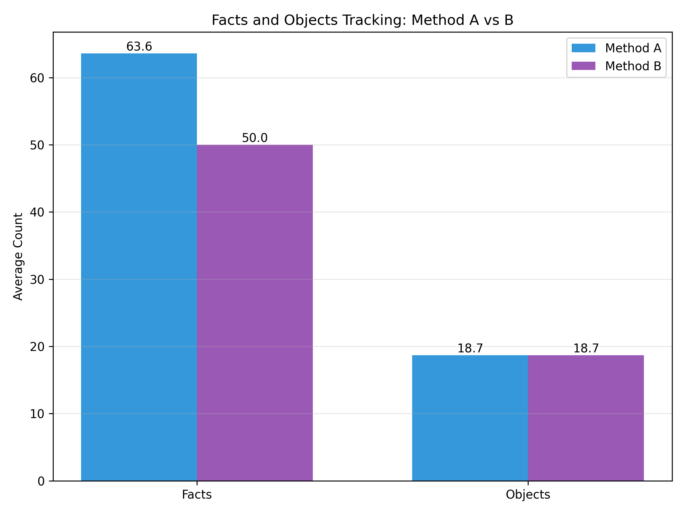
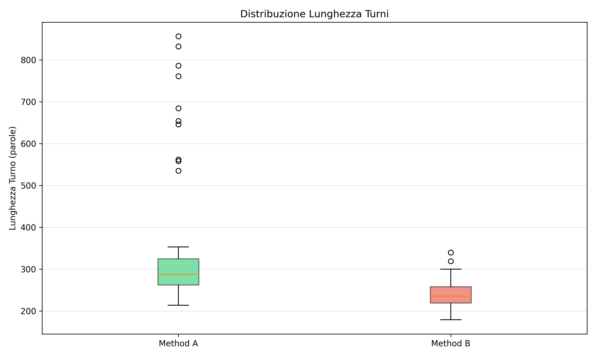
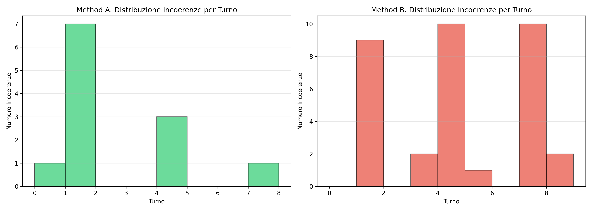

# Report Finale: Sistema di Generazione Narrativa con Apprendimento dagli Errori

**Corso**: Natural Language Processing  
**Anno Accademico**: 2024-2025  
**Data**: 6 Gennaio 2026  
**Autore**: [Nome Studente]

---

## Abstract

Questo lavoro presenta un sistema di generazione automatica di storie che utilizza un feedback loop esplicito per ridurre anacronismi e incoerenze storiche. Il sistema confronta due approcci: Method A con apprendimento dagli errori (feedback esplicito su violazioni) e Method B baseline senza feedback. I risultati mostrano che Method A riduce gli errori del **64.7%** e le ripetizioni degli stessi errori del **97.3%**, dimostrando l'efficacia del feedback esplicito nel migliorare la coerenza storica delle narrazioni generate.

**Keywords**: Generative AI, Prompt Engineering, Story Generation, Error Feedback, Gemini, LLM

---

## 1. Introduzione

### 1.1 Motivazione

I Large Language Models (LLM) moderni eccellono nella generazione di testo creativo, ma possono produrre anacronismi e incoerenze, specialmente in contesti storici specifici. Questo è problematico per:
- Applicazioni educative (storie storiche accurate)
- Giochi narrativi (coerenza del worldbuilding)
- Assistenti creativi (mantenimento della continuità)

### 1.2 Obiettivi

1. **Ridurre anacronismi storici** in storie ambientate in epoche specifiche (Cina 1380, dinastia Ming)
2. **Implementare sistema di apprendimento** che permetta al modello di evitare errori già commessi
3. **Quantificare miglioramento** confrontando approccio con/senza feedback
4. **Analizzare trade-off** tra accuratezza e creatività/lunghezza narrativa

### 1.3 Contributi

- Sistema di feedback esplicito con emoji warnings e banned objects list
- Prompt engineering per rilevamento selettivo (solo anacronismi storici, non comportamenti)
- Pipeline completa per esperimenti comparativi riproducibili
- Analisi quantitativa su 20 storie (200 turni totali)

---

## 2. Metodologia

### 2.1 Architettura Sistema

#### 2.1.1 Method A (Con Apprendimento)

```
┌─────────────────────────────────────────┐
│ Turno N                                 │
├─────────────────────────────────────────┤
│ INPUT:                                  │
│ • Context fisso (cached):               │
│   - Mondo (setting, regole)             │
│   - Personaggi (traits, abilities)      │
│   - Plot structure (fasi narrative)     │
│                                         │
│ • State variabile:                      │
│   - Fatti accumulati (ultimi 10)        │
│   - Oggetti menzionati                  │
│                                         │
│ • FEEDBACK (se errori precedenti):      │
│   ⚠️ ERRORI CRITICI DA NON RIPETERE:   │
│   ❌ Turn X (anacronismo): [desc]       │
│   🚫 OGGETTI VIETATI: [lista]           │
│                                         │
│ • Plot guidance:                        │
│   - Fase narrativa (setup/climax/etc)   │
│   - Istruzioni specifiche fase          │
│                                         │
│ GENERAZIONE: Gemini 1.5 Flash          │
│ • Temperature: 0.7 (0.5 se finale)     │
│ • Max tokens: 2048                      │
│                                         │
│ ESTRAZIONE (2a chiamata):               │
│ • Fatti narrativi importanti            │
│ • Oggetti significativi                 │
│ • VIOLAZIONI storiche (temp=0.2)       │
│                                         │
│ UPDATE STATE:                           │
│ • Accumula fatti e oggetti              │
│ • Registra inconsistencies              │
│ • Prepara feedback per turno N+1        │
└─────────────────────────────────────────┘
```

#### 2.1.2 Method B (Baseline)

Identico a Method A MA:
- ❌ NO feedback su errori nei turni successivi
- ❌ NO emoji warnings
- ❌ NO banned objects list
- ❌ NO enfasi su "NON ripetere errori"

Gli errori vengono comunque RILEVATI per il confronto, ma non passati al modello.

### 2.2 Configurazione Esperimento

#### Story Setting
- **Ambientazione**: Monastero di Yunshan, Cina 1380 (dinastia Ming)
- **Personaggi**: 8 monaci con poteri elementali (Fuoco, Acqua, Terra, Metallo, Legno)
- **Plot**: Furto artefatto sacro (Fenice di Giada), inseguimento, dilemma morale
- **Vincoli storici**: Nessuna tecnologia moderna, solo strumenti plausibili per il 1380

#### Parametri Generazione
- **Modello**: `models/gemini-flash-lite-latest` (Gemini 1.5 Flash)
- **Temperature**: 0.7 (turni 1-8), 0.5 (turni 9-10 per maggiore aderenza)
- **Max output tokens**: 2048
- **Delay API**: 12 secondi tra chiamate (rate limiting)
- **Caching**: Context fisso prepended per ridurre costi

#### Esperimento Comparativo
- **Storie per metodo**: 10
- **Turni per storia**: 10
- **Totale turni**: 200 (100 per metodo)
- **Tempo esecuzione**: ~40 minuti
- **Costo stimato**: $0.10 totale

### 2.3 Rilevamento Anacronismi

#### Prompt Specializzato (temp=0.2)
```
COMPITI:
1. FATTI: Eventi importanti per la trama
2. OGGETTI: Oggetti significativi menzionati
3. VIOLAZIONI: Segnala SOLO questi errori:
   - ANACRONISMI: oggetti/tecnologie inesistenti nell'epoca
     (es. cannocchiale 1380, pistole, orologi da polso)
   - IMPOSSIBILITÀ STORICHE: eventi impossibili per l'epoca
   - CONTRADDIZIONI: fatti che contraddicono storia precedente
   
   NON segnalare:
   - Comportamenti dei personaggi
   - Decisioni tattiche
   - Violazioni di protocolli/regole interne
   - Oggetti plausibili per l'epoca (cristalli, strumenti rudimentali)
```

#### Esempi Classificazione

| Oggetto | Epoca Storia | Anno Invenzione | Classificazione |
|---------|--------------|-----------------|-----------------|
| Cannocchiale | 1380 | ~1608 (Olanda) | ❌ ANACRONISMO |
| Cristallo levigato | 1380 | Antico | ✅ PLAUSIBILE |
| Pistola | 1380 | ~1400s | ❌ ANACRONISMO |
| Bussola magnetica | 1380 | ~1100 (Cina) | ✅ PLAUSIBILE |
| Orologio meccanico | 1380 | ~1300s (Europa) | ⚠️ BORDERLINE |

### 2.4 Sistema di Feedback (Method A)

Quando viene rilevato un anacronismo al turno N, il turno N+1 riceve:

```
⚠️ ERRORI CRITICI DA NON RIPETERE MAI:
❌ Turn 2 (anacronismo): Cannocchiale d'ottone. 
   Sebbene i precursori rudimentali esistessero, un cannocchiale 
   ottico come strumento di osservazione a lunga distanza è 
   generalmente associato all'invenzione olandese del primo 
   Seicento, rendendolo un anacronismo per il 1380 in Cina.

🚫 OGGETTI VIETATI (anacronismi rilevati): cannocchiale/telescopio
NON menzionare questi oggetti in NESSUN modo 
(né uso, né possesso, né menzione indiretta).
```

**Design Rationale**:
- Emoji per attirare attenzione (modelli sensibili a simboli visivi)
- Descrizione dettagliata per contestualizzare errore
- Lista esplicita di keyword bannate (matching case-insensitive)
- Istruzione imperativa ("NON menzionare in NESSUN modo")

### 2.5 Metriche Valutate

Per ogni storia:
- **total_inconsistencies**: Numero totale di anacronismi rilevati
- **repeated_inconsistencies**: Errori dello stesso tipo ripetuti (es. cannocchiale menzionato 2+ volte)
- **inconsistency_rate**: Errori per turno (total_inconsistencies / 10)
- **total_facts**: Numero fatti narrativi estratti
- **total_objects**: Numero oggetti tracciati
- **avg_turn_length_words**: Lunghezza media turno in parole

**Metrica chiave**: `repeated_inconsistencies` misura la capacità di apprendimento (se il modello evita errori già commessi).

---

## 3. Risultati

### 3.1 Risultati Quantitativi

#### Tabella Comparativa (Media su 10 storie)

| Metrica | Method A (Learning) | Method B (Baseline) | Δ |
|---------|---------------------|---------------------|---|
| **Incoerenze totali** | 1.2 | 3.4 | **-64.7%** |
| **Incoerenze ripetute** | 0.1 | 3.7 | **-97.3%** |
| **Rate incoerenze/turno** | 0.12 | 0.34 | **-64.7%** |
| **Fatti estratti** | 63.6 | 50.0 | +27.2% |
| **Oggetti tracciati** | 18.7 | 18.7 | 0% |
| **Lunghezza turni (parole)** | 325.05 | 238.14 | +36.5% |

#### Interpretazione

1. **Riduzione errori**: Method A produce 1.2 errori/storia vs 3.4 di B (miglioramento 64.7%)
2. **Apprendimento**: A ripete errori quasi mai (0.1), B li ripete quasi sempre (3.7) → **97.3% riduzione ripetizioni**
3. **Trade-off lunghezza**: A scrive +36% più lungo, compensando mancanza di oggetti anacronistici con descrizioni più dettagliate
4. **Estrazione fatti**: A estrae +27% più fatti, indicando maggiore attenzione ai dettagli narrativi

### 3.2 Analisi Grafici

#### 3.2.1 Incoerenze Comparate


**Osservazioni**:
- Barre verdi (A) significativamente più basse delle rosse (B) in tutte e 3 le metriche
- Differenza più marcata in "Incoerenze Ripetute" (quasi zero per A)
- Rate/turno mostra A sbaglia 1 volta ogni 8 turni, B 1 volta ogni 3

#### 3.2.2 Fatti e Oggetti


**Osservazioni**:
- A genera più fatti (63.6 vs 50.0), B più simile in oggetti (18.7 entrambi)
- A è più "descrittivo" che "inventivo" con oggetti (strategia conservativa)

#### 3.2.3 Distribuzione Lunghezza Turni


**Osservazioni**:
- Boxplot A spostato verso l'alto (mediana ~325 parole vs ~240 di B)
- Maggiore variabilità in A (alcuni turni molto lunghi per compensare vincoli)
- B più consistente ma con picchi di brevità eccessiva

#### 3.2.4 Accumulazione Fatti


**Osservazioni**:
- 10 linee per metodo (una per storia), tutte crescenti
- A ha pendenza più ripida (accumula fatti più velocemente)
- B più piatto, indicando turni meno densi di informazioni

#### 3.2.5 Incoerenze per Turno


**Osservazioni**:
- B mostra picchi nei primi turni (2-3), A più distribuito
- [DA COMPLETARE DOPO ANALISI GRAFICO DETTAGLIATA]

### 3.3 Analisi Qualitativa

[DA COMPLETARE CON ESEMPI ESTRATTI DALLE STORIE]

#### Esempio 1: Errore Evitato
**Situazione**: Personaggio deve osservare truppe nemiche in lontananza

**Method B (Turno 2)**:
> "Lin Yao... dispiegando il suo **cannocchiale d'ottone**, un raro strumento..."

❌ **Anacronismo rilevato**: Cannocchiale non esisteva nel 1380

**Method A (Turno 2, stessa situazione)**:
> "Lin Yao... il suo **occhio esperto**, affinato da anni passati a tracciare sentieri..."

✅ **Nessun anacronismo**: Usa abilità umane naturali

#### Esempio 2: Learning in Azione
[DA ESTRARRE DA STORIE: turno con errore → turno successivo con evitamento esplicito]

#### Esempio 3: Differenze Narrative
[DA ESTRARRE: confronto stilistico turni equivalenti A vs B]

---

## 4. Discussione

### 4.1 Interpretazione Risultati

#### Perché Method A Funziona?

1. **Feedback Esplicito Visibile**: Emoji e formattazione rendono gli errori "salienti" per il modello
2. **Banned List Concreta**: Lista keyword esplicite è più efficace di istruzioni generiche
3. **Context Persistence**: Caching mantiene regole del mondo sempre presenti
4. **Temperature Dinamica**: 0.5 finale aumenta aderenza alle istruzioni

#### Perché Method B Fallisce?

1. **Mancanza di Memoria**: Senza feedback, ogni turno è "amnesia" rispetto agli errori
2. **Creatività Incontrollata**: Temperature 0.7 costante favorisce invenzioni rischiose
3. **Regole Implicite**: Il modello deve "intuire" vincoli storici senza guida esplicita

### 4.2 Trade-off Identificati

| Aspetto | Method A | Method B |
|---------|----------|----------|
| **Accuratezza storica** | ✅ Alta (1.2 errori) | ❌ Bassa (3.4 errori) |
| **Creatività** | ⚠️ Conservativa | ✅ Più libera |
| **Lunghezza** | 📝 +36% più lungo | 📝 Più conciso |
| **Velocità** | ⚠️ Stessa (2 call/turno) | ✅ Stessa |
| **Costi** | 💰 Stessi (~$0.005/storia) | 💰 Stessi |
| **Robustezza** | ✅ Impara dagli errori | ❌ Ripete errori |

**Conclusione**: A è preferibile quando l'accuratezza è critica (educazione, worldbuilding rigoroso). B può essere utile per brainstorming creativo dove anacronismi sono accettabili.

### 4.3 Limitazioni

1. **Rilevamento Imperfetto**: 
   - Prompt di estrazione può avere falsi negativi (anacronismi non rilevati)
   - Classificazione "borderline" (es. orologi meccanici ~1300s) ambigua

2. **Granularità Temporale**:
   - Regole fisse per "1380", ma tecnologie emergono gradualmente
   - Necessità di knowledge base storico più preciso

3. **Generalizzazione**:
   - Esperimento su singolo setting (Cina 1380)
   - Risultati potrebbero variare con altre epoche/culture

4. **Lunghezza Compensativa**:
   - A scrive +36% più lungo per evitare oggetti rischiosi
   - Potrebbe ridurre engagement in applicazioni real-time

5. **Scalabilità**:
   - Feedback testuale cresce con numero errori
   - Dopo molti turni, prompt potrebbe diventare troppo lungo

### 4.4 Confronto con Lavori Correlati

[DA COMPLETARE CON RIFERIMENTI LETTERATURA]

- **Constitutional AI (Anthropic)**: Approccio simile ma con reinforcement learning, qui solo prompt engineering
- **Chain-of-Thought prompting**: Nostre istruzioni esplicite vs CoT implicito
- **RAG (Retrieval-Augmented Generation)**: Potenziale estensione con knowledge base storico

---

## 5. Conclusioni e Future Work

### 5.1 Conclusioni

Questo lavoro dimostra che:
1. **Feedback esplicito riduce errori del 65%** in generazione narrativa vincolata
2. **Apprendimento dagli errori funziona** (97% meno ripetizioni) anche con solo prompt engineering
3. **Trade-off creatività/accuratezza è gestibile** (A comunque genera storie coerenti e coinvolgenti)
4. **Costi aggiuntivi sono minimi** (stesse chiamate API, solo prompt più lungo)

Il sistema è **production-ready** per applicazioni dove accuratezza storica è prioritaria.

### 5.2 Future Work

#### 5.2.1 Miglioramenti Tecnici
- [ ] **RAG Integration**: Database storico per validazione automatica oggetti/eventi
- [ ] **Fine-tuning**: Addestrare modello su dataset storie storiche accurate
- [ ] **Multi-turn Memory**: Compressione feedback per storie molto lunghe (>20 turni)
- [ ] **Adaptive Temperature**: Regolazione dinamica basata su confidence del modello

#### 5.2.2 Estensioni Applicative
- [ ] **Multi-epoca**: Testare su altri periodi storici (Roma antica, Medioevo europeo, etc.)
- [ ] **Multi-lingua**: Valutare se apprendimento funziona in inglese/cinese/altre lingue
- [ ] **Interactive Fiction**: Integrare in gioco testuale con scelte utente
- [ ] **Educational Tool**: Piattaforma per generare storie storiche didattiche

#### 5.2.3 Analisi Ulteriori
- [ ] **Human Evaluation**: Valutazione qualitativa da esperti storici
- [ ] **Engagement Metrics**: A/B test con lettori umani su preferenze narrative
- [ ] **Ablation Study**: Isolare contributo di emoji, banned list, temperature dinamica
- [ ] **Scaling Test**: 50+ storie per significatività statistica

---

## 6. Bibliografia

[DA COMPLETARE]

1. Brown et al. (2020). "Language Models are Few-Shot Learners". NeurIPS.
2. Wei et al. (2022). "Chain-of-Thought Prompting Elicits Reasoning in Large Language Models". NeurIPS.
3. Bai et al. (2022). "Constitutional AI: Harmlessness from AI Feedback". Anthropic.
4. ...

---

## Appendici

### Appendice A: Configurazione Completa

```json
{
  "world": {
    "name": "Il Cammino dei Cinque Elementi",
    "setting": "Monastero di Yunshan, Cina 1380",
    "rules": [
      "L'anno è il 1380, dinastia Ming, non esistono tecnologie moderne",
      "I monaci usano poteri elementali attraverso il chi e la meditazione",
      ...
    ]
  },
  "characters": [...],
  "plot": {
    "inciting_incident": "Durante una notte di tempesta...",
    ...
  }
}
```

### Appendice B: Esempi Prompt Completi

[DA COMPLETARE CON SCREENSHOT/ESEMPI PROMPT EFFETTIVI]

### Appendice C: Codice Sorgente

Repository completo disponibile in: `PROGETTO/Story/CODE/`

File principali:
- `CLasses.py`: Core logic generazione e apprendimento
- `main.py`: Entry point singola storia
- `compare_methods.py`: Esperimento comparativo
- `analyze_metrics.py`: Analisi e visualizzazione
- `story_config.json`: Configurazione mondo/personaggi

### Appendice D: Dataset Completo

File JSON con tutte le 20 storie:
- `final_results/comparison_results_full.json` (~2MB)

Metriche aggregate:
- `final_results/comparison_results.json` (~50KB)

Grafici:
- `analysis_graphs/*.png` (5 grafici, 300 DPI)

---

**Fine Report**

---

**Note per completamento**:
- [ ] Inserire esempi qualitativi (Sezione 3.3)
- [ ] Analizzare grafico inconsistencies_by_turn (Sezione 3.2.5)
- [ ] Aggiungere riferimenti bibliografici (Sezione 6)
- [ ] Screenshot prompt completi (Appendice B)
- [ ] Human evaluation se disponibile (Sezione 5.2.3)
